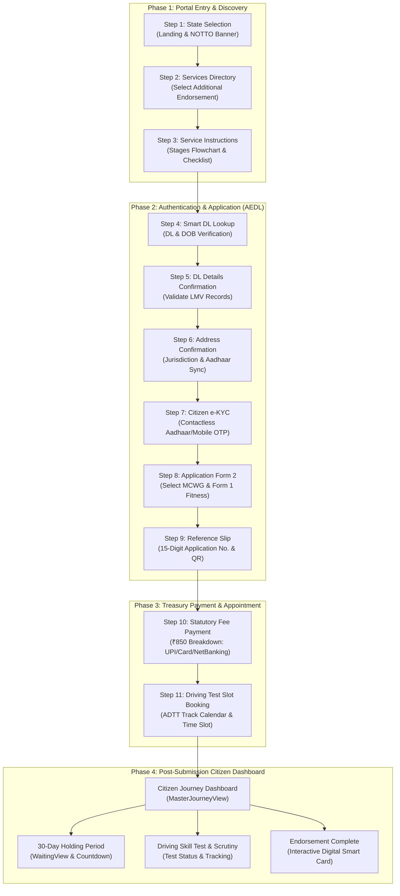
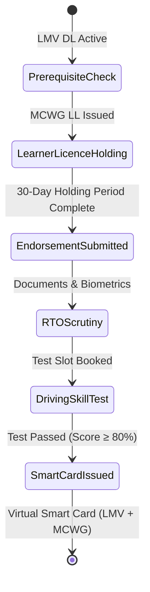

# Sarathi Journey: End-to-End Citizen User Flow Specification

This document details the complete, current citizen user flow of the **Sarathi Journey** platform—specifically for adding a new vehicle class to an existing licence (**Existing LMV Driving Licence → Add MCWG / Motorcycle With Gear**).

---

## 1. High-Level Architecture & User Flow Diagram

---

## 2. Step-by-Step Flow Specification

### Step 1: State Selection & Portal Landing
- **Route / Component**: [`Step1StateSelection.tsx`](file:///e:/Portfolio/Hackathon/Sarathi%20Journey%20%28Open%20AI%20x%20Varun%20Mayaa%29/src/components/portal-entry/Step1StateSelection.tsx)
- **User Intent**: The citizen arrives at the platform and selects their state/UT jurisdiction.
- **Key Elements**:
  - **NOTTO Organ Donation Carousel**: Clean auto-cycling awareness banner positioned above the hero with a compact slogan strip (*"Others can live when we agree to give..."*).
  - **State Dropdown**: Full-width selector defaulting to `-Select The State-`, supporting all 36 Indian States and Union Territories.
  - **Proceed CTA**: Advances to Step 2 with the selected state context.
- **State Transition**: `selectedState` updated → advances to `Step 2`.

---

### Step 2: Driving Licence Services Directory
- **Route / Component**: [`Step2ServicesHub.tsx`](file:///e:/Portfolio/Hackathon/Sarathi%20Journey%20%28Open%20AI%20x%20Varun%20Mayaa%29/src/components/portal-entry/Step2ServicesHub.tsx)
- **User Intent**: Citizen identifies the specific licence service they wish to execute.
- **Key Elements**:
  - **Services Grid**: Complete catalog of standard driving licence services displayed with consistent visual styling.
  - **Single Active Flow Tile**: **"Additional Endorsement to DL"** is prominently highlighted as the active service.
  - **Direct One-Click Navigation**: Clicking on the Additional Endorsement tile immediately proceeds to Step 3 without unnecessary secondary buttons.
  - Non-active services are non-functional (no-op) to preserve flow focus.
- **State Transition**: `selectedService` set to `add_endorsement_mcwg` → advances to `Step 3`.

---

### Step 3: Service Instructions & Process Roadmap
- **Route / Component**: [`Step3ServiceInstructions.tsx`](file:///e:/Portfolio/Hackathon/Sarathi%20Journey%20%28Open%20AI%20x%20Varun%20Mayaa%29/src/components/portal-entry/Step3ServiceInstructions.tsx)
- **User Intent**: Citizen reviews the application requirements and workflow before entering sensitive credentials.
- **Key Elements**:
  - **Left-to-Right Stages Flowchart Diagram**: 4 sequentially connected cards (`Stage 1: DL Lookup` → `Stage 2: Eligibility` → `Stage 3: Fee Payment` → `Stage 4: Test Slot Booking`) with circular stage numbers, duration tags, and forward chevrons.
  - **Highlighted "What You Will Need" Checklist**: Clean vertical list inside an elevated accent container:
    1. *Existing Driving Licence (DL)* (16-character number).
    2. *Active MCWG Learner's Licence (LL)* (CMVR Rule 15 holding period verified).
    3. *Aadhaar / Mobile for OTP* (contactless e-signing).
    4. *Statutory Government Fee* (₹850 online payable).
  - **Medical Guidance Callout**: Explains that Form 1-A medical certificates are only mandatory for commercial categories or applicants over 40.
  - **Navigation**: `← Back to Services Directory` and `Proceed to Enter DL Details →`.
- **State Transition**: Advances to `Step 4`.

---

### Step 4: Smart DL Lookup & Normalizer
- **Route / Component**: [`Step4SmartDlLookup.tsx`](file:///e:/Portfolio/Hackathon/Sarathi%20Journey%20%28Open%20AI%20x%20Varun%20Mayaa%29/src/components/portal-entry/Step4SmartDlLookup.tsx)
- **User Intent**: The citizen inputs their existing DL number and Date of Birth to fetch national registry records.
- **Key Elements**:
  - **11-Step Breadcrumb Progress Bar**: Begins rendering dynamically from Step 4 onward to track application progress.
  - **Smart Input Normalizer**: Accepts any common DL input format (with or without spaces/hyphens) and normalizes it to standard format (`DL-0420110023456`).
  - **Subtle Placeholders**: Lightly styled test placeholders (`DL-0420110023456` and `15/08/1995`).
  - **Verified Record Preview Card**: Live verified card displaying holder name (`Advait Sharma`), DOB, blood group, currently authorized classes (`LMV`), and issuing authority.
  - **Proceed CTA**: `Proceed to Details & Endorsement →`.
- **State Transition**: `dlNumber` and `dob` saved → advances to `Step 5`.

---

### Step 5: Licence Details Confirmation
- **Route / Component**: [`Step5DlDetailsConfirmation.tsx`](file:///e:/Portfolio/Hackathon/Sarathi%20Journey%20%28Open%20AI%20x%20Varun%20Mayaa%29/src/components/portal-entry/Step5DlDetailsConfirmation.tsx)
- **User Intent**: Citizen confirms their registered driving licence profile and vehicle class authorizations.
- **Key Elements**:
  - Full details breakdown: Initial Issue Date, Validity Span, Non-Transport Expiry (2035), and Issuing RTO.
  - COV (Class of Vehicle) badge matrix showing current `LMV` status.
  - Statutory Endorsement Eligibility confirmation.
- **State Transition**: Advances to `Step 6`.

---

### Step 6: Address & Jurisdiction Confirmation
- **Route / Component**: [`Step6AddressConfirmation.tsx`](file:///e:/Portfolio/Hackathon/Sarathi%20Journey%20%28Open%20AI%20x%20Varun%20Mayaa%29/src/components/portal-entry/Step6AddressConfirmation.tsx)
- **User Intent**: Verify residential address and RTO jurisdiction mapping.
- **Key Elements**:
  - Dual-card display of Permanent Address vs Current Present Address.
  - Interactive **Aadhaar Address Sync** checkbox.
  - RTO jurisdictional jurisdiction matching for driving test routing.
- **State Transition**: Advances to `Step 7`.

---

### Step 7: Citizen Authentication & Contactless e-KYC
- **Route / Component**: [`Step7CitizenAuthentication.tsx`](file:///e:/Portfolio/Hackathon/Sarathi%20Journey%20%28Open%20AI%20x%20Varun%20Mayaa%29/src/components/portal-entry/Step7CitizenAuthentication.tsx)
- **User Intent**: Authenticate identity and e-sign the application via OTP (no login/password required).
- **Key Elements**:
  - Tabbed mode selection: **Aadhaar OTP** or **Mobile OTP**.
  - 6-digit numeric input with auto-focus and paste support.
  - Live simulation quick-fill and 60-second resend countdown timer.
  - Security audit and session authentication confirmation.
- **State Transition**: Citizen authenticated → advances to `Step 8`.

---

### Step 8: AEDL Form 2 Application & Form 1 Physical Fitness
- **Route / Component**: [`Step8EndorsementApplicationForm.tsx`](file:///e:/Portfolio/Hackathon/Sarathi%20Journey%20%28Open%20AI%20x%20Varun%20Mayaa%29/src/components/portal-entry/Step8EndorsementApplicationForm.tsx)
- **User Intent**: Submit statutory Form 2 application for Motorcycle With Gear (MCWG) endorsement and complete self-declared fitness.
- **Key Elements**:
  - **Endorsement Class Selection**: `MCWG (Motorcycle With Gear)` checkbox.
  - **Form 1 Physical Fitness Modal (`Form1PhysicalFitnessModal.tsx`)**: 6-question statutory medical questionnaire with instant pass/fail evaluation.
  - Voluntary Organ Donor pledge consent option.
- **State Transition**: Form 2 and Form 1 submitted → advances to `Step 9`.

---

### Step 9: Application Reference Slip
- **Route / Component**: [`Step9ApplicationReferenceSlip.tsx`](file:///e:/Portfolio/Hackathon/Sarathi%20Journey%20%28Open%20AI%20x%20Varun%20Mayaa%29/src/components/portal-entry/Step9ApplicationReferenceSlip.tsx)
- **User Intent**: Receive official application reference identifier and verification receipt.
- **Key Elements**:
  - Official 15-digit reference ID: `DL-2026-08-984210`.
  - Scannable QR code for instant RTO document lookup.
  - Printable summary and PDF download capability.
  - `Proceed to Statutory Payment →` button.
- **State Transition**: Advances to `Step 10`.

---

### Step 10: Statutory Treasury Fee Payment
- **Route / Component**: [`Step10StatutoryFeePayment.tsx`](file:///e:/Portfolio/Hackathon/Sarathi%20Journey%20%28Open%20AI%20x%20Varun%20Mayaa%29/src/components/portal-entry/Step10StatutoryFeePayment.tsx)
- **User Intent**: Pay the mandated government fee online securely.
- **Key Elements**:
  - **Treasury Breakdown Table**:
    - Endorsement Fee: ₹500
    - MCWG Driving Test Fee: ₹300
    - Automated Track Facility Charge: ₹50
    - **Total Statutory Payable: ₹850**
  - Payment options: `UPI / QR Code`, `NetBanking`, `Debit/Credit Card`.
  - Mock payment gateway processor with instant transaction confirmation.
- **State Transition**: Payment verified → advances to `Step 11`.

---

### Step 11: Driving Test Slot Booking
- **Route / Component**: [`Step11DrivingTestSlotBooking.tsx`](file:///e:/Portfolio/Hackathon/Sarathi%20Journey%20%28Open%20AI%20x%20Varun%20Mayaa%29/src/components/portal-entry/Step11DrivingTestSlotBooking.tsx)
- **User Intent**: Book an appointment slot at the Automated Driving Test Track (ADTT) facility.
- **Key Elements**:
  - Track facility info: ADTT Automated Track Facility.
  - Interactive Date Picker showing real-time slot availability.
  - Time Slot Selection: Morning (`09:00 AM - 11:00 AM`, `11:30 AM - 01:30 PM`) and Afternoon (`02:30 PM - 04:30 PM`).
  - Appointment Confirmation Pass with test day checklist.
- **State Transition**: Completes the 11-step portal flow and hands off to the **Citizen Journey Dashboard**.

---

## 3. Post-Submission Citizen Journey Lifecycle

After slot booking, the user transitions to the **Citizen Journey Dashboard** ([`MasterJourneyView.tsx`](file:///e:/Portfolio/Hackathon/Sarathi%20Journey%20%28Open%20AI%20x%20Varun%20Mayaa%29/src/components/journey/MasterJourneyView.tsx)):

1. **Stage 1: Prerequisite Check**: Validates active LMV licence.
2. **Stage 2: Learner Licence & 30-Day Holding Period**: Countdown timer tracking statutory holding period before driving test.
3. **Stage 3: Application Submission**: Form 2 application and fee confirmation.
4. **Stage 4: RTO Scrutiny**: Document audit and biometric scheduling.
5. **Stage 5: Automated Driving Skill Test**: On-track sensor-monitored driving test (Figure-8, serpentine, hill start).
6. **Stage 6: Approval & Smart Card Issuance**: Interactive digital smart card rendering dual endorsements (`LMV` + `MCWG`).

---

## 4. Key UX Principles Implemented
- **Zero Impersonation & Clean Voice**: Transparent digital platform assistant without bureaucratic clutter.
- **OTP-Only Authentication**: Frictionless e-KYC eliminating outdated username/password barriers.
- **Single-Active Journey Focus**: Guided primary path preventing confusion across multiple concurrent services.
- **Instant Progressive Disclosure**: Direct click-through interactions and clear left-to-right roadmap diagrams.
- **Accessibility by Default**: Dynamic text scaling, high-contrast tokens, keyboard-accessible skip links, and screen-reader compliant SVGs.
